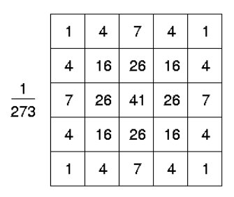
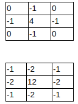
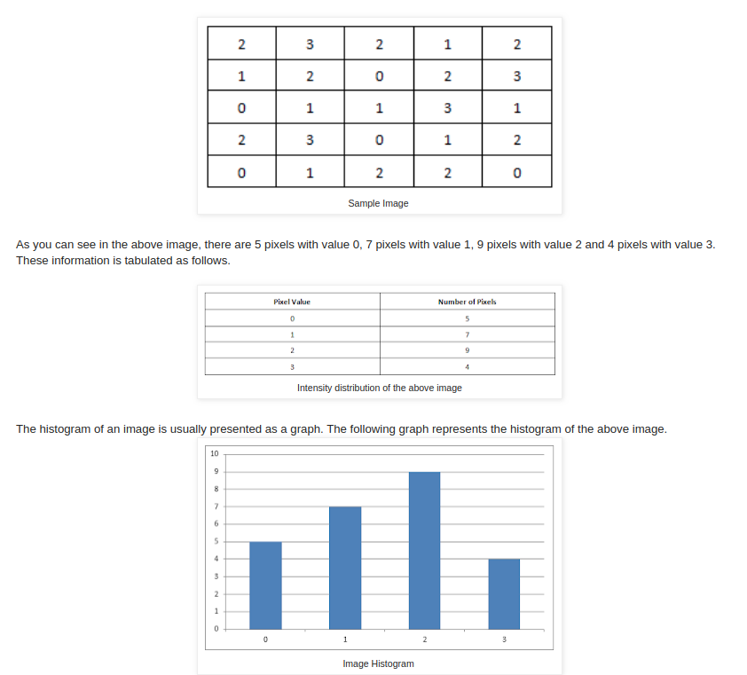

# Document Smoothing
## I:Blur
### 1: Blur (Low-Pass Filtering)
[LPF](https://diffractionlimited.com/help/maximdl/MaxIm-DL.htm#High-Pass_Filtering.htm)\
[Blur](https://docs.opencv.org/4.1.2/d4/d86/group__imgproc__filter.html#ga8c45db9afe636703801b0b2e440fce37)
* Kernel với mỗi phần từ có giá trị bằng 1, kích thước kernel do mình chỉ định sau đó tính trung bình các pixel trong kernel.
* Hình ảnh minh họa \
.
### 2: MedianBlur
[MedianBlur](https://docs.opencv.org/4.1.2/d4/d86/group__imgproc__filter.html#ga8c45db9afe636703801b0b2e440fce37)
* Kernel với sẽ chuyển về mảng 1 chiều đã được sắp xếp pixel trung tâm sẽ được thay bằng trung vị của mảng.
* Ví Dụ: mảng đã được sắp xếp {3,4,5,6,7,7,8,9,10} thì median sẽ là 7.
### 3: GaussianBlur
[Gaussian Smoothing](https://homepages.inf.ed.ac.uk/rbf/HIPR2/gsmooth.htm)
* Kernel sau khi tính toán theo hàm Gauss sẽ có dạng ma trận mà tâm của ma trận sẽ lớn nhất và nhỏ dần khi mở rộng ra ngoài biên.
* Hình ảnh minh họa \
.
### 4: BilateralFilter
[BilateralFilter](https://docs.opencv.org/3.4.3/d4/d86/group__imgproc__filter.html#ga9d7064d478c95d60003cf839430737ed)
* Loại bỏ nhiễu nhưng vẫn giữ được biên. BilateralFilter cũng sử dụng bộ lọc Gauss nhưng có thêm một bước là nó chỉ xét nhưng điểm có mức xám tương đồng với pixel trung tâm để làm mịn do nhưng điểm ảnh ở biên có sự thay đổi mức xám rất rõ ràng.
### 5:Filter2D
* Convolution với kernel mình tạo ra \
  `Tạo kernel` 
```
    float array[3][3]={{0,-0.25,0},{-0.25,2,-0.25},{0,-0.25,0}};

    Mat kernel(Kernel_size,Kernel_size,CV_32F,array);
```
* link [Filter2D](https://docs.opencv.org/2.4/doc/tutorials/imgproc/imgtrans/filter_2d/filter_2d.html)
### 6: BoxFilter
* Giống với Blur boxFilter cũng dùng Mat::ones/(ksizeWidth*KsizeHeight) nhưng boxfilter có thêm tham số độ sâu của ảnh và nếu normalize = False thì kernel sẽ là chỉ là Mat::ones.
* Link [BoxFilter](https://docs.opencv.org/4.1.2/d4/d86/group__imgproc__filter.html#gad533230ebf2d42509547d514f7d3fbc3)
### 7: Motion blur
* link [MotionBlur](https://subscription.packtpub.com/book/application_development/9781785283932/2/ch02lvl1sec21/motion-blur)
* Motion Blur sẽ làm nhòe ảnh trông vật thể như đang di chuyển khi được chụp
* Kernel sẽ là ma trận full 0 và giá trị hàng thứ kernel_size/2 = 1/kernel_size (thường kernel_size = 15)
* VD: Kernel_size = 5  
* 
## II: Sharpen
### 1: High-Pass Filtering
* link [HPF](http://opencv-tutorials-hub.blogspot.com/2016/02/opencv-code-for-high-pass-filter.html)
* Sử dụng bộ lọc với nhân là dương và các phần tử xung quanh là âm.
* 
### 2: Unsharp Filter
* link [Unsharp](https://homepages.inf.ed.ac.uk/rbf/HIPR2/unsharp.htm)
* Sử dụng mask bị làm mờ rồi lấy ảnh gốc trừ đi.
## III: Contrast
### 1: The Contrast and Brightness of an image
* link [Contrast & Brightness](https://docs.opencv.org/3.4/d3/dc1/tutorial_basic_linear_transform.html)
* Để tăng ngưỡng sáng của ảnh lên ta sử dụng công thức:
```
    g(i,j) = α.f(i,j) + β 
```
* The parameters α>0 and β are often called the gain and bias parameters
### 2: Histogram Equalization (HE)
* link [HE](https://www.opencv-srf.com/2018/02/histogram-equalization.html)
* Ý tưởng của HE sẽ là xếp các giá trị pixcel thành các cột và san đều chúng ra bằng nhau.
* EX 
### 3: Two-dimensional histogram equalization
* link []
* Ý tưởng 
* Ex
## IV Image Deblurring
### 1: Out-of-focus Deblur Filter
* Mathematical model of the image degradation in frequency domain representation:
```
    S = H . U + N
```
* S is a spectrum of blurred image, U is a spectrum of original true image
* H  is a frequency response of point spread function (PSF)
* N is a spectrum of additive noise